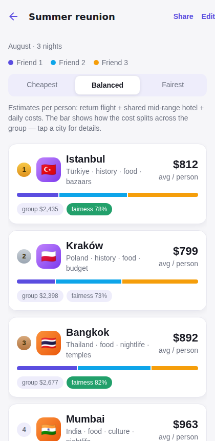
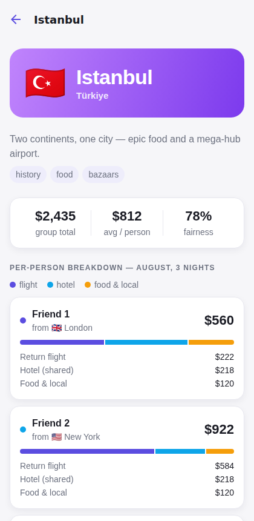
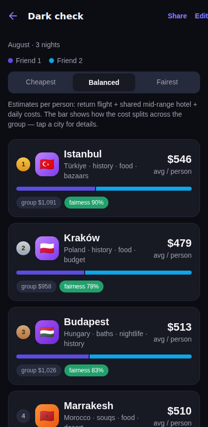

# GoTogether ✈️

**Find the best city for friends in different countries to meet up.**

Add your friends, their home cities and budgets — GoTogether ranks ~50 cities
worldwide by what the get-together actually costs *each person* (return flight
+ shared hotel + daily costs), and lets you trade off **cheapest overall**
against **fairest for everyone**.

One codebase, three targets: it runs as a web app and as a native **iOS**
(and Android) app via [Expo](https://expo.dev).

| Home | Ranked results | Per-person breakdown |
|---|---|---|
|  |  |  |

| Trip invites | Dark mode |
|---|---|
|  |  |

## How the ranking works

For every candidate city, each traveler gets an estimated cost:

```
return flight (seasonal, distance & hub adjusted)
+ hotel share (mid-range, double occupancy)
+ food & local transport × nights
```

Cities are then scored on a blend you control:

- **Cheapest** — minimise the group's total spend
- **Fairest** — minimise how unevenly the cost falls across the group
  (measured as 1 − coefficient of variation)
- Cities that blow someone's stated budget are penalised and flagged

## Sharing a trip

Every trip has a **Share** action that produces a link with the whole trip
encoded in the URL — no accounts, no backend. Friends who open it land on the
`/join` screen, get a local copy saved to their device, and can add themselves
or tweak budgets.

## Pricing: estimates now, live quotes when you want them

By default prices come from a deterministic estimator (`src/lib/pricing/`):
distance-banded return fares adjusted for airport competitiveness and season,
plus per-city hotel/food indices. Same inputs → same prices, fully offline.

For live quotes, run the bundled Amadeus proxy (keeps your API key off the
client) and point the app at it:

```bash
AMADEUS_CLIENT_ID=xxx AMADEUS_CLIENT_SECRET=yyy node server/pricing-proxy.mjs
EXPO_PUBLIC_PRICE_PROXY_URL=http://localhost:8787 npx expo start
```

Quotes are cached for 24h per route+month, and any route the API can't price
falls back to the estimator automatically (see `FallbackProvider`). See
[docs/BRAINSTORM.md](docs/BRAINSTORM.md) for the full product brainstorm and
roadmap.

## Getting started

```bash
npm install
npx expo start
```

- **Web** — press `w`, or `npm run web`
- **iOS** — press `i` for the iOS Simulator (macOS), or scan the QR code with
  [Expo Go](https://expo.dev/go) on an iPhone
- **Android** — press `a`, or scan the QR code with Expo Go

To ship a standalone iOS app, use [EAS Build](https://docs.expo.dev/build/introduction/):
`npx eas build -p ios`. The web app is a static export (`npm run build:web` →
`dist/`) deployable to any static host.

## Development

```bash
npx tsc --noEmit     # typecheck
npm run lint         # eslint (expo lint)
npm run build:web    # static web export into dist/
npm run e2e          # Playwright smoke test against dist/
```

### Project layout

```
src/
  app/                  expo-router screens
    index.tsx           trip list (home)
    new-trip.tsx        create/edit trip (modal)
    trip/[id]/index.tsx ranked destinations for a trip
    trip/[id]/[city].tsx  per-person cost breakdown
  components/           shared UI (buttons, city picker, result cards…)
  lib/
    data/cities.ts      candidate city dataset (prices, coords, vibes)
    pricing/            PriceProvider interface + estimator + Amadeus stub
    scoring.ts          the ranking engine (cost × fairness × budget)
    store.tsx           trips state, persisted via AsyncStorage
```

Trips are stored on-device (AsyncStorage → localStorage on web); there is no
backend and the app works offline.
