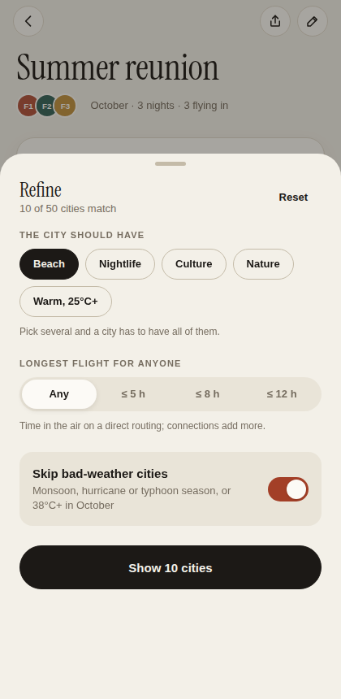
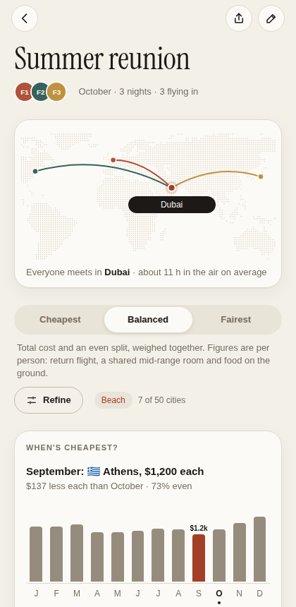
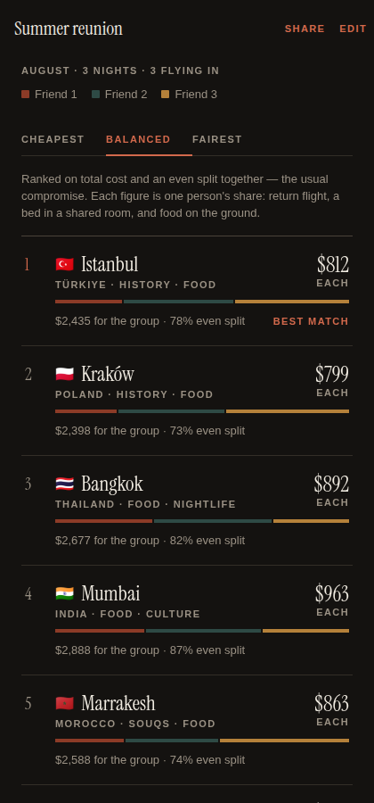

# GoTogether

**Find the best city for friends in different countries to meet up.**

Add your friends, their home cities and budgets — GoTogether ranks ~50 cities
worldwide by what the get-together actually costs *each person* (return flight
+ shared hotel + daily costs), and lets you trade off **cheapest overall**
against **fairest for everyone**.

One codebase, three targets: it runs as a web app and as a native **iOS**
(and Android) app via [Expo](https://expo.dev).

| Home | Ranked results | Who pays what |
|---|---|---|
|  |  |  |

| Refine | When's cheapest? | Dark mode |
|---|---|---|
|  |  |  |

## Design

Paper and ink, softened. The palette is warm paper stock, ink type and one
stamp-red accent used sparingly. Instrument Serif carries the display type.
Surfaces are rounded cards with hairline edges and very soft shadows. There
are no gradients, and no emoji used as icons (flags stay, because they're
data).

**Motion is the point of this version.** One set of springs and curves in
`src/constants/theme.ts` (`Motion`) drives everything:

- Switching Cheapest / Balanced / Fairest slides the segmented thumb,
  glides each result card into its new position, rolls the prices to their
  new values, and re-routes the map to the new top pick.
- The route map pans and zooms to frame everyone and draws each traveller's
  arc into the meeting city.
- Screens stagger in, large titles collapse into the header as you scroll,
  and the city picker is a drag-to-dismiss sheet.
- Every tap target sinks on a spring and, on iOS and Android, gives a light
  haptic. On iOS 26 the floating action bar is Liquid Glass.
- Reduced-motion settings are respected.

Shared primitives: `PressableScale`, `Card`, `Button`, `Chip`, `Avatar`,
`Segmented`, `Sheet`, `WorldMap`, `CostBar`, `AnimatedNumber`,
`ScreenHeader`.

## How the ranking works

For every candidate city, each traveler gets an estimated cost:

```
return flight (distance-calibrated, airport, month & destination season)
+ share of a mid-range double room (taxes and resort fees included, seasonal)
+ food & local transport × nights
```

Each destination also shows the expected weather for the trip month, with
monsoon, hurricane, rainy-season and extreme-heat warnings, plus its hotel
season and each traveler's time in the air.

Then **Refine** narrows the list to places the group would actually go.
Every change re-sorts the list behind the sheet live:

- **Vibes:** beach (only in beach weather, 23°C+ that month), nightlife,
  culture, nature, or warm (25°C+ in the trip month, from climate data).
  Pick several and a city must have them all.
- **Longest flight for anyone:** ≤ 5, 8 or 12 hours in the air.
- **Skip bad-weather cities** (on by default): monsoon, hurricane and
  typhoon seasons, or 38°C+.

Filters are saved with the trip and travel with its share link.

**Anyone out?** Any friend can veto a city from its detail screen ("I'm
out on Vegas"). It drops out of the ranking, the map and the month chart for
everyone, travels in the share link, and can be restored from Refine.

**Check live prices.** Every destination suggests concrete dates (the second
Friday of the trip month, for the chosen number of nights) and hands off to
real searches: Kayak and Google for each traveler's flights, and Booking.com
for the group's rooms, sized two to a room. No API keys needed; this is the
bridge until live pricing is wired in.

**When's cheapest?** Under the filters, a 12-month chart shows what the best
city would cost each person in every month, with the same mode and filters
(the weather filters change month to month). Tap a month to preview it:
"September: Athens, $1,200 each, $137 less than October". Tap **Plan for
September** to move the trip.

Cities are then scored on a blend you control:

- **Cheapest** — minimise the group's total spend
- **Fairest** — minimise how unevenly the cost falls across the group
  (measured as 1 − coefficient of variation)
- Cities that blow someone's stated budget are penalised and flagged

## Sharing a trip

Every trip has a **Share** action that produces a link with the whole trip
encoded in the URL — no accounts, no backend. Friends who open it land on the
`/join` screen, get a local copy saved to their device, and can add themselves
or tweak budgets.

## Pricing: calibrated estimates, live quotes when you want them

Prices come from a deterministic estimator (`src/lib/pricing/`) calibrated
in September 2026 against published fares and hotel rates. On seven
benchmark routes it lands within ±11% of the typical return fare, and
`npm run check:data` keeps it that way in CI. Same inputs give the same
prices, fully offline.

For live quotes, point the app at a pricing proxy that implements two
endpoints (contract in `src/lib/pricing/proxy-provider.ts`):

```bash
EXPO_PUBLIC_PRICE_PROXY_URL=https://your-proxy.example npx expo start
```

Any route the proxy can't price falls back to the estimator automatically
(`FallbackProvider`). **Amadeus Self-Service, which the previous proxy
wrapped, shut down on 17 July 2026.** See
[docs/DATA_SOURCES.md](docs/DATA_SOURCES.md) for sources, known limitations
and the recommended replacement stack (Travelpayouts, Duffel, LiteAPI).
[docs/BRAINSTORM.md](docs/BRAINSTORM.md) has the product roadmap.

## Getting started

```bash
npm install
npx expo start
```

- **Web** — press `w`, or `npm run web`
- **iOS** — press `i` for the iOS Simulator (macOS), or scan the QR code with
  [Expo Go](https://expo.dev/go) on an iPhone
- **Android** — press `a`, or scan the QR code with Expo Go

To ship a standalone iOS app, use [EAS Build](https://docs.expo.dev/build/introduction/):
`npx eas build -p ios`. The web app is a static export (`npm run build:web` →
`dist/`) deployable to any static host.

## Development

```bash
npm run typecheck    # tsc
npm run lint         # eslint (expo lint)
npm run check:data   # dataset sanity + fare calibration against benchmarks
npm run build:web    # static web export into dist/
npm run e2e          # Playwright smoke test against dist/ (light + dark)
```

### Project layout

```
src/
  app/                  expo-router screens
    index.tsx           trip list (home)
    new-trip.tsx        create/edit trip (modal)
    trip/[id]/index.tsx ranked destinations for a trip
    trip/[id]/[city].tsx  per-person cost breakdown
  components/           shared UI (cards, sheet, map, segmented, result cards…)
  lib/
    data/cities.ts      50-city dataset: prices, seasons, climate, coords
    data/land-dots.ts   dotted world map (generated: scripts/gen-land-dots.mjs)
    pricing/            PriceProvider interface, estimator, live-proxy client
    scoring.ts          the ranking engine (cost × fairness × budget)
    store.tsx           trips state, persisted via AsyncStorage
```

Trips are stored on-device (AsyncStorage → localStorage on web); there is no
backend and the app works offline.
